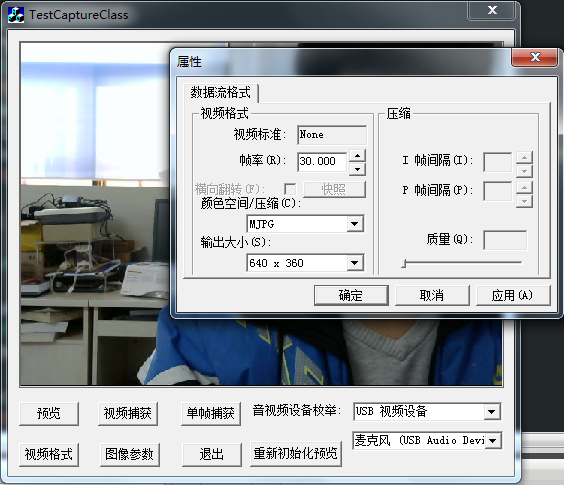

#DriectXShow

**前言**
> 1、DirectShow是微软公司提供的一套在Windows平台上进行流媒体处理的开发包，与DirectX开发包一起发布。DirectShow为多媒体流的捕捉和回放提供了强有力的支持。用DirectShow开发应用程序，我们可以很方便地从支持WDM驱动模型的采集卡上捕获数据，并且进行相应的后期处理乃至存储到文件中。

> 2、DirectShow是基于COM的，为了编写DirectShow应用程序，需要了解COM客户程序编写的基础知识。DirectShow提供了大量的接口，但在编程中发现还是不够方便，如果能构建一个视频捕捉类把常用的一些动作封装起来，那么就更方便了。

**编程思路**
> 为了更加容易建立视频捕捉应用程序，DirectShow提供了一个叫做Capture Graph Builder的对象，Capture Graph Builder提供IcaptureGraphBuilder2接口，该接口可以建立和控制Capture Graph。

> 建立视频捕捉程序，必须首先获取并初始化IcaptureGraphBuilder2接口，然后选择一个适当的视频捕捉设备。选择好设备后，为该设备创建Capturefilter，然后调用AddFilter把Capture filter添加到Filter Graph。如果仅仅希望用摄像头来进行实时监控的话，只需要在上面的基础上调用ICaptureGraphBuilder2::RenderStream就可以了

------------

>本程序在VS2010 PlatForm采用Micosoft 的DriectXShow9.0b SDK编写的一套实时视频捕捉，采集功能，
并且还提供了视频和单帧图像参数设置界面，采集的视频流和单帧图像都写在文件中，之后使用OpenCV进行音视频的处理，
当然这是我后期要做的事情，前面部分已经完成，前半部分开发使用了因为很多东西要查，
需要学习DXShow如何设计filter graph manger 和filter graph 的创建以及pin 的连接，最后renderstream,产生视频流，
之后，在视频流上捕捉单帧图像数据，加入图像头，写入文件进行保存到文件系统.

##环境配置:

+  1.首先保证已经正确安装了MicroSoft的DXSDK,请一定安装DriectXShow9.0b版本的SDK包，这里我将其安装了在C盘根目录下。
+  2.打开VS2010项目,在项目属性中设置项目需要使用的项目需要包含的包含目录和库目录.
+ 具体步骤:
    + 项目-项目名属性-配置属性-VC++目录-包含目录-“C:\DXSDK\Include”.
    + 项目-项目名属性-配置属性-VC++目录-包含目录-“C:\DXSDK\Lib”.

##软件效果:
**全局效果:**

**视频格式设置:**

**图像格式设置:**

